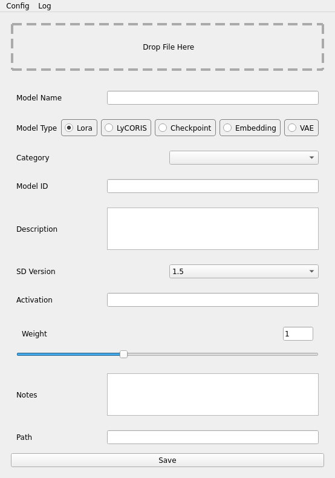

# Stable Diffusion File Manager

A small script to help sort downloaded models. This script will sort files into their proper folders, based on given parameters. It them uses the same parameters to generate a json compatible with Automatic1111's Extra Networks GUI. Stores slightly more information than the json generated by Automatic1111. For people who want a bit more customization outside of downloader extensions available, or not using the webui.

## Screenshot


## Installation

### Requirements
Current build on Python 3.9.13
Uses PyQt5

### Run
```
python main.py
```

## Usage

Drag and drop each file into the window. Fill in the information you want, and clicking save will do the transfer/create the json file. Changing the name will update the name of the file.

## Configuration

Rename config-template.json to config.json, and change your root path.

In the case of this example:
```
ai
 |-stable-diffusion
 | |-lora
 | |-checkpoints
```

The link path would be
```
/ai/stable-diffusion
```

## Todo
 - [ ] Add configuration for different naming formats (ex. id-name.safetensor)
 - [x] Add configuration for default data
 - [ ] Add feature to auto populate fields
    - [ ] file type (checkpoint, lora, etc)
	- [ ] sd version
 - [ ] Add feature to auto move a preview image with the same name if exists
 - [ ] Add feature to have config determine possible :
    - [ ] Model Types (radio buttons)
	- [ ] Categories  (dropdown)
	- [ ] SD Version  (dropdown)
	- [ ] Preferred Weight (slider)
 - [ ] Logging

## License
[GPLv3](https://www.gnu.org/licenses/gpl-3.0.html).